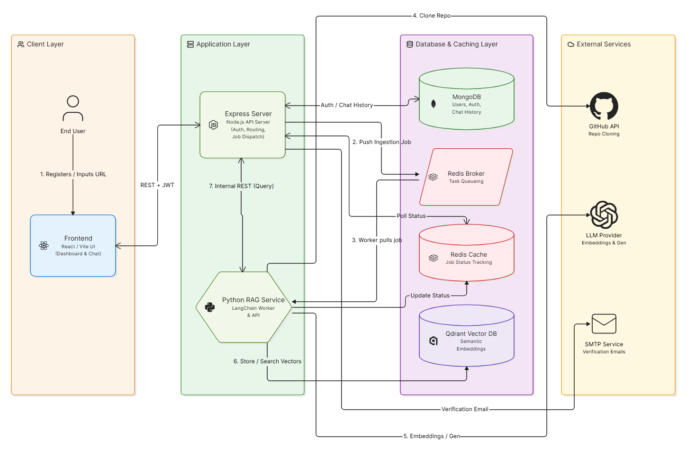
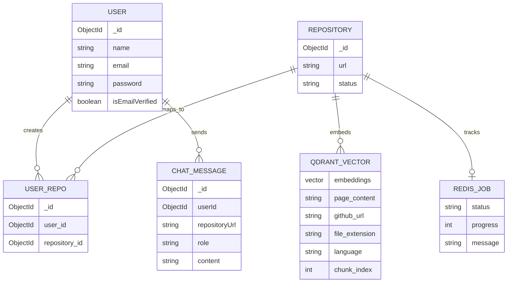
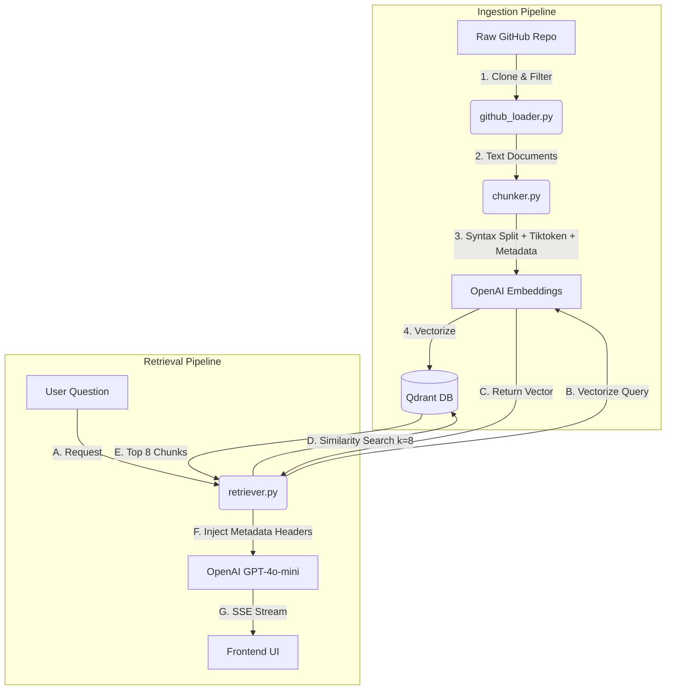

<div align="center">
  <h1>RAG Codebase Explainer</h1>
  <p><strong>Your Intelligent Pair-Programmer for Any GitHub Repository</strong></p>
</div>

<br />

The **RAG Codebase Explainer** is a full-stack, production-ready application that allows developers to paste any GitHub repository URL, ingest its entire source code using Retrieval-Augmented Generation (RAG), and interactively chat with the codebase in real-time. It acts as an intelligent pair-programmer to help you understand complex architecture, logic, and dependencies within seconds.

---

## 🚀 Features

- **Automated Repository Ingestion:** Give it a GitHub URL, and the system automatically clones, parses, and splits the source code using **Token-Based Chunking (Tiktoken cl100k_base)** and **Multi-Language Syntax Awareness** for optimal AI context windows.
- **Retrieval-Augmented Generation (RAG):** Uses OpenAI embeddings and a high-performance **Qdrant Vector Database** for lightning-fast semantic search.
- **Streaming AI Responses:** Powered by FastAPI and Server-Sent Events (SSE), AI responses stream back to the user instantly, just like ChatGPT.
- **Secure Authentication:** Complete JWT-based authentication system with HTTP-only cookies, robust password hashing, and email verification workflows.
- **Job Queuing & Background Processing:** Uses **Redis** queues to asynchronously handle heavy code-chunking and embedding without blocking the main Node.js server.
- **Modern Glassmorphic UI:** A highly responsive, animated, and beautiful dashboard built with React and Vite.

---

## 🏗️ Architecture & Workflow



### How It Works:
1. **User Request:** The user pastes a GitHub URL on the React frontend.
2. **Node.js Orchestration:** The Express server receives the request, creates a Job ID, and pushes an ingestion task to the Redis Queue.
3. **Python Worker Execution:** A background FastAPI worker picks up the job from Redis, clones the repo, chunks the AST (Abstract Syntax Tree), and pushes vectors to Qdrant.
4. **Chat Interface:** Once ingested, the user asks questions. The Node.js server forwards the context to the Python LLM engine, which streams the answer back to the frontend via SSE.

### 🗄️ Database Schema & Data Isolation
The architecture strictly enforces data isolation so users only interact with repositories they explicitly ingested.



### ⚡ Dataflow Pipeline


---

## 💻 Tech Stack

- **Frontend:** React 19, Vite, React Router, Lucide React, Tailwind-inspired Vanilla CSS.
- **Backend (API Gateway):** Node.js, Express, MongoDB (Mongoose), JWT, Nodemailer.
- **Worker (AI Engine):** Python, FastAPI, LangChain, OpenAI, Redis-py.
- **Databases:** MongoDB (User state & Chat History), Qdrant (Vector Embeddings), Redis (Job Queues & Caching).

---

## ⚙️ Local Setup & Installation

### Prerequisites
Make sure you have the following installed:
- Node.js (v18+)
- Python (3.10+)
- Redis Server (Running on port `6379`)
- MongoDB (Running locally or via Atlas)
- Qdrant (Running locally via Docker: `docker run -p 6333:6333 qdrant/qdrant`)

### 1. Clone the Repository
```bash
git clone https://github.com/your-username/rag-codebase-explainer.git
cd rag-codebase-explainer
```

### 2. Configure Environment Variables

**Backend (`server/.env`):**
```env
PORT=5000
MONGODB_URI=mongodb://localhost:27017/rag_db
CORS_ORIGIN=http://localhost:5173
ACCESS_TOKEN_SECRET=your_access_secret
REFRESH_TOKEN_SECRET=your_refresh_secret
REDIS_URL=redis://localhost:6379
PYTHON_WORKER_URL=http://127.0.0.1:8000
BACKEND_URL=http://localhost:5000
# SMTP Settings for Email Verification (Optional for dev)
SMTP_HOST=sandbox.smtp.mailtrap.io
SMTP_PORT=2525
SMTP_USER=your_user
SMTP_PASS=your_pass
```

**Worker (`worker/.env`):**
```env
OPENAI_API_KEY=sk-your-openai-key
QDRANT_URL=http://localhost:6333
REDIS_URL=redis://localhost:6379
```

**Frontend (`frontend/.env`):**
```env
VITE_API_BASE_URL=http://localhost:5000
```

### 3. Start the Node.js Server
```bash
cd server
npm install
npm start
```

### 4. Start the Python AI Worker
```bash
cd worker
python -m venv venv
source venv/bin/activate  # Or `venv\Scripts\activate` on Windows
pip install -r requirements.txt
uvicorn app.api:app --port 8000
```
*(You can also run the worker manually via `python app/main.py` to listen to Redis jobs).*

### 5. Start the React Frontend
```bash
cd frontend
npm install
npm run dev
```

---

## 🔒 Security & Production Readiness
This application is fully equipped for cross-domain production deployment:
- Implements `helmet` for HTTP header security.
- `express-rate-limit` to prevent brute-force attacks.
- Dynamically configures `sameSite: "none"` and `secure: true` for HTTP-only cookies in production, allowing seamless separation between Vercel (Frontend) and Render (Backend).

<br />

<div align="center">
  <p>Crafted with passion by <strong>Rupam</strong>.</p>
</div>
